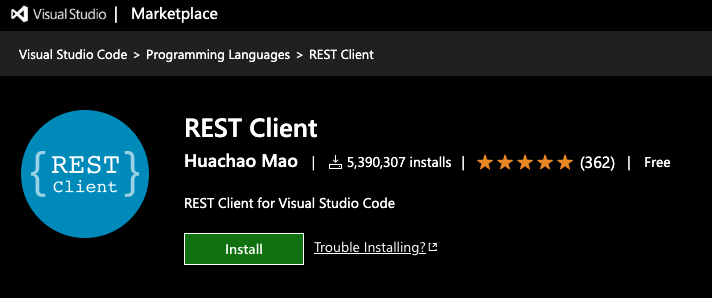
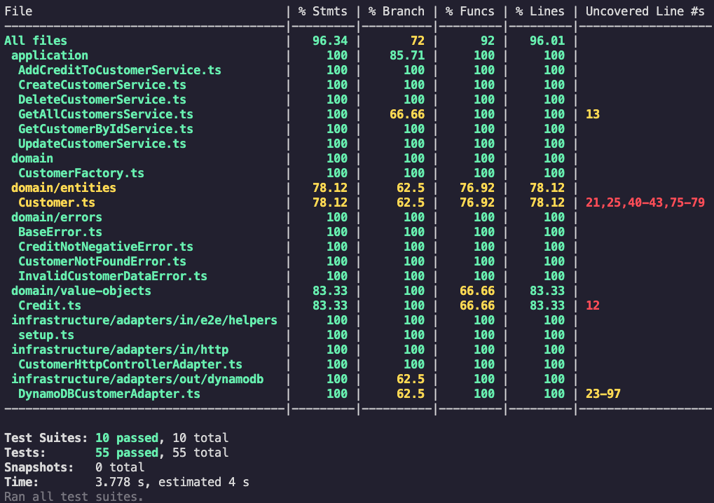
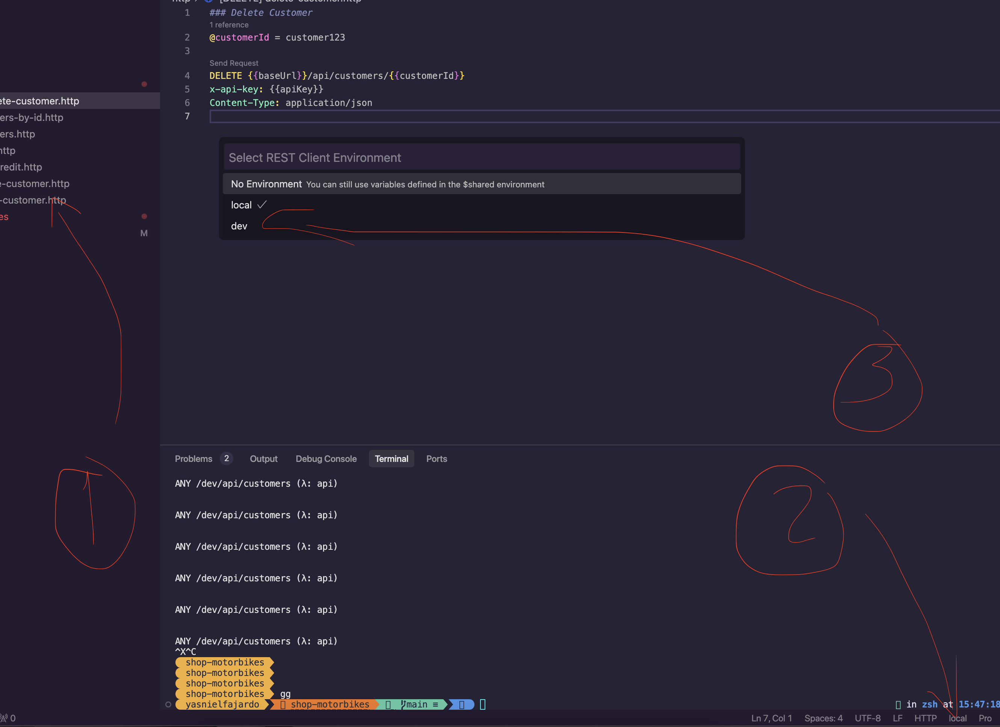

# Motorbike Shop Customer Management API

A serverless API for managing customers in a motorbike shop, built with AWS Lambda, API Gateway, and DynamoDB. The project follows Hexagonal Architecture and Domain-Driven Design principles.


## Architecture

The project follows a clean architecture approach with three main layers:

- **Domain Layer**: Contains business logic, entities and ports
- **Application Layer**: Contains use cases
- **Infrastructure Layer**: Contains adapters for external services

### Architectural Patterns Used

1. **Hexagonal Architecture (Ports and Adapters)**
   - Clear separation between business logic and external dependencies
   - Business logic is isolated in the domain layer
   - Ports define interfaces for input and output
   - Adapters implement these interfaces for specific technologies

2. **Domain-Driven Design (DDD)**
   - Rich domain models with business logic
   - Value objects for immutable concepts
   - Aggregates for consistency boundaries
   - Repository pattern for persistence

3. **Clean Code Principles**
   - Single Responsibility Principle
   - Dependency Inversion
   - Interface Segregation
   - Clear naming conventions

## Prerequisites

- Docker (because we use DynamoDB Local for local development)
- Node.js 18.x or later
- Serverless Framework CLI (`npm install -g serverless`)
- Visual Studio Code
    - [REST Client](https://marketplace.visualstudio.com/items?itemName=humao.rest-client)


## Project Setup

1. Clone the repository:
```bash
git clone https://github.com/yasniel1408/taxdown-shop-motorbikes
cd shop-motorbikes
```

2. Install dependencies:
```bash
npm install
```

3. Deploy to AWS:
```bash
npm run deploy:dev
```
4. To run the API locally:

```bash
npm run dev
```
if you have some error run this command with serverless version 3 or 4
```bash
npm run start:db && npm run create:table && serverless dev --stage dev
```

The API will be available at `http://localhost:3000`

## API Endpoints

All endpoints require an API key in the `x-api-key` header.


## Testing

The project includes `.http` files in the `/http` directory for testing all endpoints. These can be used with REST Client in VS Code or similar tools.

### Test Files Location
```
/http/
├── [GET] health.http
├── [GET] customers.http
├── [GET] customers-by-id.http
├── [POST] create-customer.http
├── [PUT] update-customer.http
├── [DELETE] delete-customer.http
└── [POST] add-credit.http
```

### Test Coverage
The project includes unit test and integration test.


### Develop environment test

1. Get your API key from the deployment output
2. Update the API key in the ./vscode/settings.json file
3. Select environment `dev`
4. Execute *.http files



## Project Structure

```
src/
├── application/           # Application layer
│   ├── ports/            # Ports (interfaces)
│   │   ├── in/          # Input ports (use cases)
│   │   └── out/         # Output ports (repositories)
│   └── services/        # Application services
├── domain/               # Domain layer
│   ├── entities/        # Domain entities
│   └── value-objects/   # Value objects
└── infrastructure/       # Infrastructure layer
    ├── adapters/        # Adapters
    │   ├── in/         # Input adapters (controllers)
    │   └── out/        # Output adapters (repositories)
    └── config/         # Configuration
```


## Security Features

1. **API Gateway Security**
   - API Key authentication required for all endpoints
   - Secure key distribution and management

2. **Rate Limiting**
   - 100 requests per 15 minutes per IP
   - Prevents abuse and DoS attacks

3. **CORS Configuration**
   - Properly configured CORS headers
   - Secure cross-origin resource sharing

4. **Input Validation**
   - Request payload validation
   - Type checking and sanitization
   - Error handling for invalid inputs

5. **Error Handling**
   - Consistent error response format
   - Production-safe error messages
   - Detailed logging for debugging
